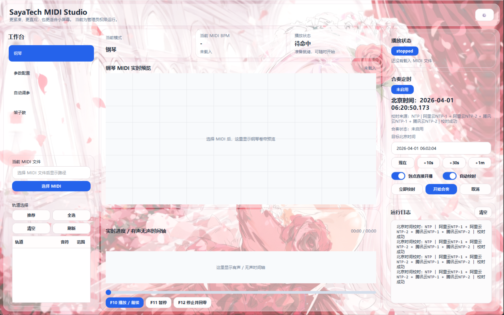
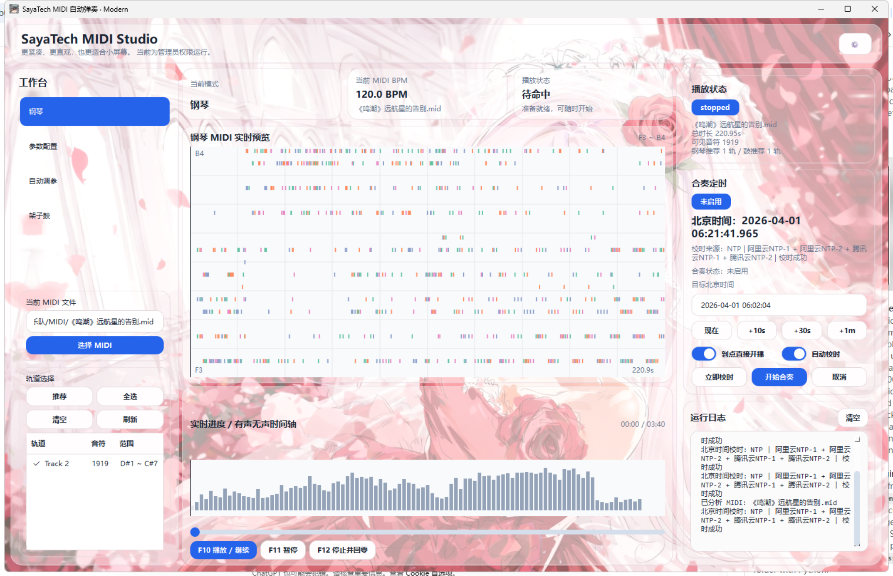
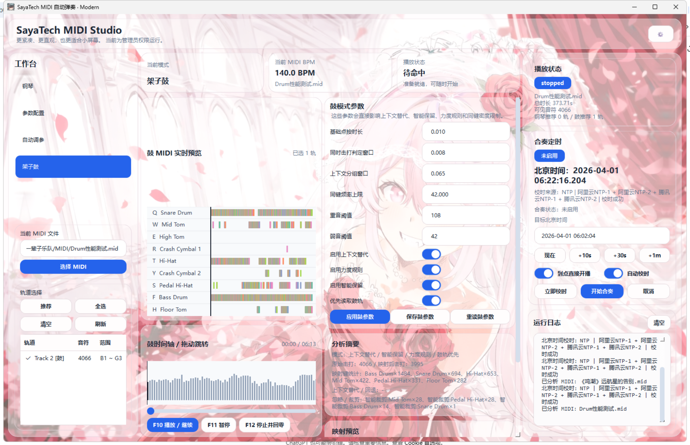
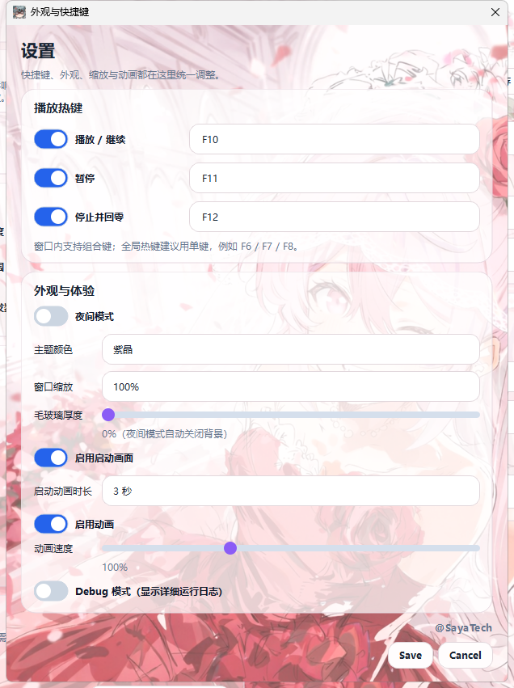
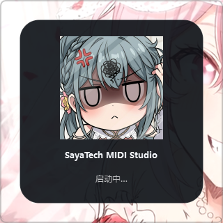
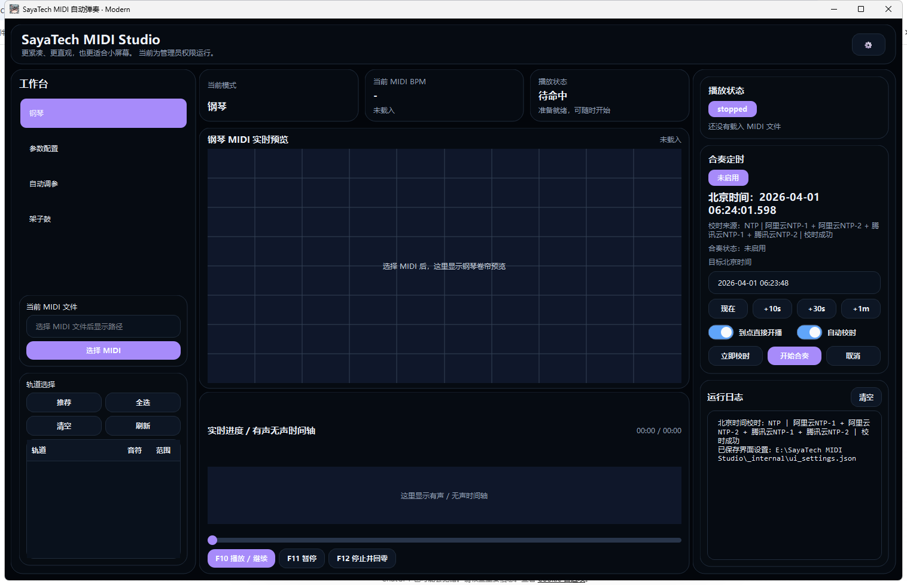

<div align="center">


# SayaTech-Midi-Studio

**一个面向 Windows 的 MIDI 自动演奏工作室，集成钢琴 / 架子鼓演奏、自动调参、启动动画、主题与毛玻璃界面。**

[简体中文](README.md) · [English](README.en.md) · [日本語](README.ja.md)
[](https://github.com/ShiroiSaya/SayaTech-Midi-Studio)
[](LICENSE)

**仓库地址：** <https://github.com/ShiroiSaya/SayaTech-Midi-Studio>

```bash
git clone https://github.com/ShiroiSaya/SayaTech-Midi-Studio.git
cd SayaTech-Midi-Studio
```


</div>

## 预览

### 主界面（未载入 MIDI）


### 钢琴页面


### 架子鼓页面


### 设置页面


### 启动画面


### 夜间模式


## 功能特性

- 钢琴 MIDI 自动演奏
- 架子鼓 MIDI 自动演奏
- 自动调参与参数建议
- 短区间固定窗口逻辑
- 合奏定时 / 北京时间校时
- 可配置热键
- 多主题、夜间模式、毛玻璃界面
- 可选启动动画
- 配置悬停说明与更直观的参数命名
- 崩溃日志与运行日志

## 适用环境

- Windows 10 / 11
- Python 3.10+
- 适合 PySide6 图形界面环境
- 适合需要向游戏或窗口注入键盘输入的使用场景

## 下载与 Release

- 你发布到 GitHub Releases 时，推荐上传的安装包文件名：`SayaTech_MIDI_Studio_Setup.exe`
- 单文件便携版可使用：`SayaTech_MIDI_Studio.exe`
- Release 页面建议地址：<https://github.com/ShiroiSaya/SayaTech-Midi-Studio/releases>

## 快速开始

```bash
git clone https://github.com/ShiroiSaya/SayaTech-Midi-Studio.git
cd SayaTech-Midi-Studio
pip install -r requirements.txt
python app.py
```

## 打包

### 单文件 EXE
可以使用项目内的一键打包脚本，或直接使用 PyInstaller。输出文件名为：`dist/SayaTech_MIDI_Studio.exe`

### 安装版
推荐使用 onedir + Inno Setup 的方式生成安装程序，启动速度会比单文件版更好。安装包输出文件名固定为：`installer_output/SayaTech_MIDI_Studio_Setup.exe`

## 项目亮点

这个项目不是单纯的脚本集合，而是一套完整的 MIDI 自动演奏工作流：

- 图形化主界面
- 钢琴 / 架子鼓双工作台
- 自动调参与参数联动
- 统一设置中心
- 启动画面与视觉主题
- 更适合发布和分发的打包方案

## 仓库结构

```text
.
├─ app.py
├─ sayatech_modern/
├─ docs/
│  └─ assets/
├─ scripts/
├─ SayaTech_MIDI_Studio_onefile.spec
├─ SayaTech_MIDI_Studio_onedir.spec
├─ installer.iss
├─ config.txt
├─ config.example.txt
├─ requirements.txt
└─ LICENSE
```

## 说明

- 浅色模式下支持背景图与毛玻璃效果
- 夜间模式会自动禁用背景图，以保证可读性和稳定性
- 首次运行时，程序会优先读取仓库内的 `config.txt`；如果缺失，则自动按默认模板生成
- README 中使用的界面截图均来自当前较新的版本界面
- Release 中建议上传安装包 `SayaTech_MIDI_Studio_Setup.exe`，仓库源码中不直接包含已构建二进制文件

## License

本项目采用 **MIT License** 发布，详见仓库根目录下的 [LICENSE](LICENSE) 文件。

## 依赖

运行与打包依赖已整理到仓库根目录的 [requirements.txt](requirements.txt) 中。

